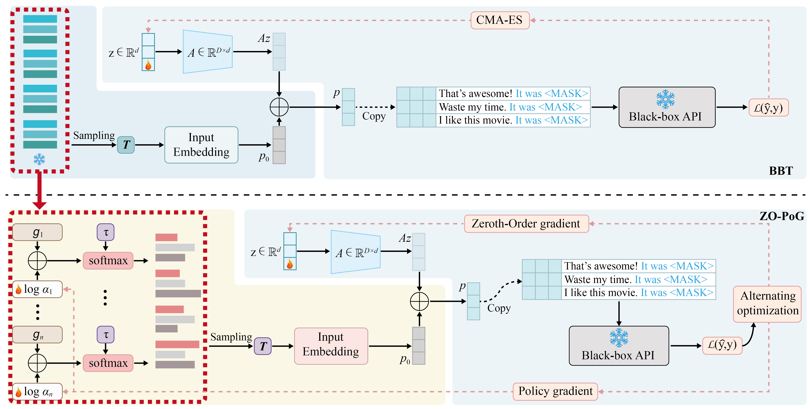

# **Collaborative Discrete-Continuous Black-Box Prompt Learning for Language Models**  

  

## 🚀 Quick Start  

### **Requirements**  
Run the following command to install dependencies:  
```bash
bash install.sh
```  

### **Running Experiments**  
To execute experiments, use the following commands:  

```bash
bash zo_pog_LM.sh 0 0.01 0.001 20
bash zo_pog_causal.sh 0 0.01 0.001 20
```  

## 📌 Citation  

If you find this work helpful, please cite our paper:  

```bibtex
@inproceedings{
zhang2025collaborative,
title={Collaborative Discrete-Continuous Black-Box Prompt Learning for Language Models},
author={Hualin Zhang and Haozhen Zhang and Zhekai Liu and Bin Gu and Yi Chang},
booktitle={The Thirteenth International Conference on Learning Representations},
year={2025},
url={https://openreview.net/forum?id=sdLGY9Dj5r}
}
```  

For any questions or issues, feel free to reach out or open an issue. 🚀  
